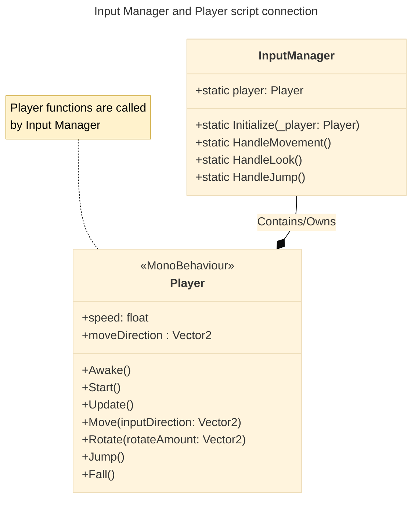

```mermaid
---
title: Input Manager and Player script connection
config:
  theme: base
  themeVariables:
    noteBkgColor: '#FFF2CC'
    noteBorderColor: '#D6B656'
    noteTextColor: '#000000'
---

classDiagram

	class InputManager{

		+static player: Player
		+static Initialize(_player: Player)
		+static HandleMovement()
		+static HandleLook()
		+static HandleJump()
	}

	note for Player "Player functions are called <br> by Input Manager"
	class Player{
		<<MonoBehaviour>>
		+speed: float
		+moveDirection : Vector2
		+Awake()
		+Start()
		+Update()
		+Move(inputDirection: Vector2)
		+Rotate(rotateAmount: Vector2)
		+Jump()
		+Fall()

	}


	%% Connections
	InputManager --* Player: Contains/Owns


```
