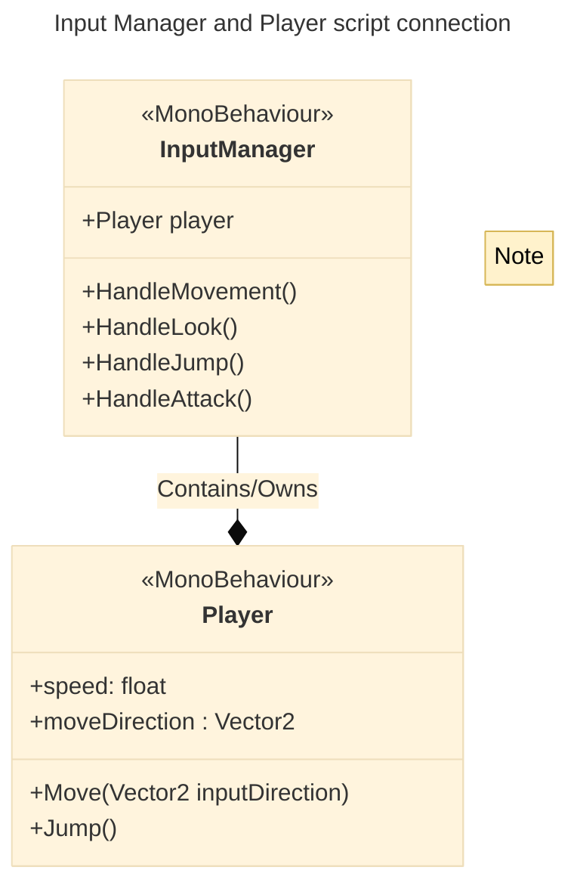

```mermaid
---
title: Input Manager and Player script connection
config:
  theme: base
  themeVariables:
    noteBkgColor: '#FFF2CC'
    noteBorderColor: '#D6B656'
    noteTextColor: '#000000'
---

classDiagram

	class InputManager{
		<<MonoBehaviour>>
		+Player player
		+HandleMovement()
		+HandleLook()
		+HandleJump()
		+HandleAttack()
	}

	class Player{
		<<MonoBehaviour>>
		+speed: float
		+moveDirection : Vector2
		+Move(Vector2 inputDirection)
		+Jump()
	}


	%% Connections
	InputManager --* Player: Contains/Owns


	%% notes
	note "Note"


```
